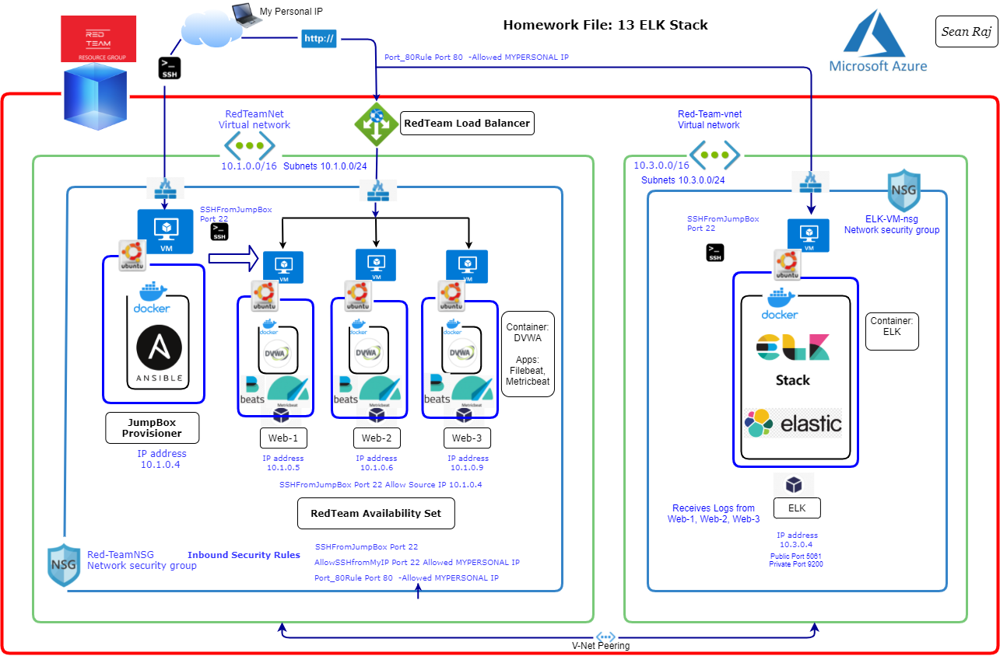

## Automated ELK Stack Deployment

The files in this repository were used to configure the network depicted below.

These files have been tested and used to generate a live ELK deployment on Azure. They can be used to either recreate the entire deployment pictured above. Alternatively, select portions of the yaml file may be used to install only certain pieces of it, such as Filebeat.

(Ansible/intsall.elk.yml)
(Ansible/metricbeat.yml)
(Ansible/pentest.yml)

This document contains the following details:
- Description of the Topologu
- Access Policies
- ELK Configuration
  - Beats in Use
  - Machines Being Monitored
- How to Use the Ansible Build

### Description of the Topology

The main purpose of this network is to expose a load-balanced and monitored instance of DVWA, the D*mn Vulnerable Web Application.

Load balancing ensures that the application will be highly Available, in addition to restricting Access to the network.
 
A jumpbox is a system on a network used to access and manage devices in a separate security zone.  Jump servers are typically placed between a secure zone and a DMZ to provide transparent management of devices on the DMZ once a management session has been established. The jump server acts as a single audit point for traffic and also a single place where user accounts can be managed. A prospective administrator must log into the jump server in order to gain access to the DMZ assets and all access can be logged for later audit.
A load balancer is a device that acts as a reverse proxy and distributes network or application traffic across a number of servers. Load balancers are used to increase capacity (concurrent users) and reliability and availability of applications.

Integrating an ELK server allows users to easily monitor the vulnerable VMs for changes to the Log-Files and system Resouces.
 Filebeat watches for system logs and forward any changes to the Elasticsearch Host
 Metricbeat collects metrics and system resources usage for display in Elasticsearch

The configuration details of each machine may be found below.
_Note: Use the [Markdown Table Generator](http://www.tablesgenerator.com/markdown_tables) to add/remove values from the table_.

| Name      | Function               | IP Address  | Operating System |
|-----------|------------------------|-------------|------------------|
| Jump Box  | Provisioning / Gateway | 10.1.0.4    | Ubuntu /Linux           |
| Web-1     | Web-Server             | 10.1.0.5    | Ubuntu /Linux          |
| Web-2     | Web-Server             | 10.1.0.6    | Ubuntu /Linux          |
| Web-3     | Web-Server             | 10.1.0.9    | Ubuntu /Linux         |
| ELK       | ElasticSearch Stack    | 10.3.0.4    | Ubuntu /Linux          |

### Access Policies

The machines on the internal network are not exposed to the public Internet. 

Only the jumpbox can accept connections from the Internet via SSH. Access to this machine is only allowed from the following IP addresses: 

[mypersonal-ip-address]

Machines within the network can only be accessed by Jumpbox Server.

JumpBoxProvisioner
Public IP address; 20.62.192.166
Private IP address; 10.1.0.4

A summary of the access policies in place can be found in the table below.

| Name          | Publicly Accessible | Allowed IP Addresses  |
|---------------|---------------------|-----------------------|
| Jump Box      | SSH - 22 - Yes      | MyPersonal IP Address |
| Web 1,2,3     | No                  | 10.1.0.4              |
| Load Balancer | HTTP - 80 - Yes     |                       |
| ELK           | Kibana - 5601 - Yes | MyPersonal IP Address |
| ELK           | HTTP - 9200 - Yes   | 10.1.0.0/16           |

### Elk Configuration

Ansible was used to automate configuration of the ELK machine. No configuration was performed manually, which is advantageous because...
_
The primary benefit of Ansible is it allows IT administrators to automate away the drudgery from their daily tasks... reduces configuration errors

The playbook implements the following tasks:

Install Docker: Installs the core docker code to the remote server docker.io  
Install Python3_pip: Pip is an installation module that allows for additional docker modules to be installed easier
Docker Module: Tells the previous PIP module to install the necessary docker component modules
Increase Memory/Use More Memory: A common issue with the ELK Docker image is to little memory. This help fix the issue to allow the server to launch
Download and Launch ELK Container: This downloads the ELK docker container and initializes it with the specified ports being published

The following screenshot displays the result of running `docker ps` after successfully configuring the ELK instance. (Images/Dockerps.png)

### Target Machines & Beats
This ELK server is configured to monitor the following machines:

- 10.1.0.5
- 10.1.0.6 
- 10.1.0.9
- 10.3.0.4  

We have installed the following Beats on these machines:

Filebeat and Metricbeat installed on the following Systems: Web1, Web2, Web3

These Beats allow us to collect the following information from each machine:
 
Filebeat monitors the log files or locations that you specify, collects log events, and forwards them either to Elasticsearch or Logstash for indexing. Filebeat consists of two main components: inputs and harvesters.  
Metricbeat helps you monitor your servers by collecting metrics from the system and services running on the server, such as: Apache. HAProxy.

### Using the Playbook
In order to use the playbook, you will need to have an Ansible control node already configured. Assuming you have such a control node provisioned: 

SSH into the control node and follow the steps below:
- Copy the Yaml file to /etc/ansible.
- Update the hosts file to include...groups of webservers (machines)
- Run the playbook, and navigate to Elk Server (Kibana) to check that the installation worked as expected.

 
Playbooks are written in YAML format. YAML stands for Yet Another Markup Language. Playbooks are one of the core features of Ansible and tell Ansible what to execute. They are like a to-do list for Ansible that contains a list of tasks.
install.elk.yml ... You copy it to /etc/ansible/

Which file do you update to make Ansible run the playbook on a specific machine? Hosts file

How do I specify which machine to install the ELK server on versus which to install Filebeat on? 

Under the Hosts file... /etc/ansible .. the yaml files contains groups - Webserves: Web1, Web 2, Web3  & Elk Server ..these yaml playbooks specify where filebeat & metricbeat applications need to be installed. 

Which URL do you navigate to in order to check that the ELK server is running?
 - http://[your_elk_server_ip]:5601/app/kibana

Specific commands the user will need to run to download the playbook, update the files, etc._
> ansible.yml
nano hosts
ansible-playbook ansible.yml

